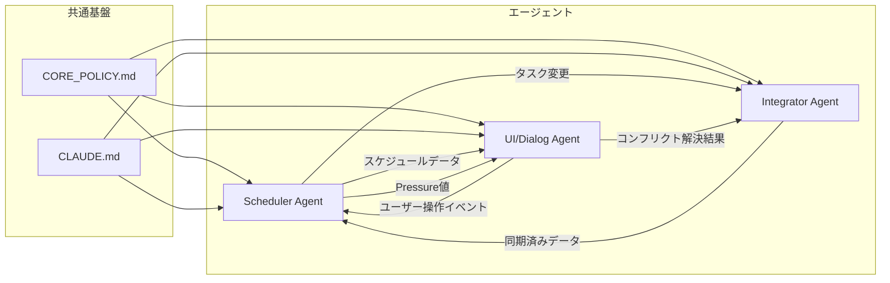

# AGENTS.md — Pomodoroom エージェント運用規定

> **❗ 最初に [CORE_POLICY.md](file:///c:/Users/rebui/Desktop/pomodoroom/CORE_POLICY.md) を読むこと。**
> 本プロジェクトの思想・原則・絶対ルールが定義されている。
> これを読まずに作業を始めてはならない。
>
> 本文書は CORE_POLICY の原則を「誰が・どう実行するか」に落とし込む運用規定である。

---

## 1. エージェント分類と責務

### 1.1 概要



### 1.2 Scheduler Agent

**担当仕様書:** [docs/domains/scheduler.md](file:///c:/Users/rebui/Desktop/pomodoroom/docs/domains/scheduler.md)

**責務:**
- 日次スケジュールの自動生成・再計算
- Pressure値の算出とモード遷移判定
- 次タスク候補の選定（最大2〜3件 + 理由）
- DailyTemplate に基づく時間枠の割り当て
- タスク優先度のスコアリング

**所有ファイル（編集権限）:**
```
crates/pomodoroom-core/src/scheduler/
crates/pomodoroom-core/src/scoring.rs
crates/pomodoroom-core/src/focus_windows.rs
crates/pomodoroom-core/src/long_break_placement.rs
crates/pomodoroom-core/src/context_switch.rs
crates/pomodoroom-core/src/bayesian_tuner.rs
crates/pomodoroom-core/src/simulation.rs
crates/pomodoroom-cli/src/commands/schedule.rs
```

**入力:** タスク一覧、DailyTemplate、カレンダーイベント、現在時刻
**出力:** ScheduledBlock配列、Pressure値、次タスク候補

---

### 1.3 UI/Dialog Agent

**担当仕様書:** [docs/domains/ui-dialog.md](file:///c:/Users/rebui/Desktop/pomodoroom/docs/domains/ui-dialog.md)

**責務:**
- 回避不能な介入ダイアログの実装（Tauriウインドウ）
- タスク操作UI（開始・完了・延長・中断・再開・先送り）
- Material 3 デザイン基準に準拠したフロントエンド構築
- コンフリクト解決ダイアログの表示
- コンテキスト（数理モデルベース）の再提示UI
- Pressureモードに応じた介入強度の視覚的表現

**所有ファイル（編集権限）:**
```
src/components/m3/
src/views/
src/hooks/
src/types/
src/index.css
src/App.tsx
src/main.tsx
src-tauri/src/window.rs
src-tauri/src/tray.rs
```

**入力:** Scheduler からのスケジュールデータ・Pressure値・次タスク候補
**出力:** ユーザー操作イベント（タスク状態遷移指示）

---

### 1.4 Integrator Agent

**担当仕様書:** [docs/domains/integrator.md](file:///c:/Users/rebui/Desktop/pomodoroom/docs/domains/integrator.md)

**責務:**
- Google Calendar との双方向同期
- SQLite ↔ Calendar イベントのデータマッピング
- OAuth認証フローの管理
- コンフリクト検出と解決フローの起動（UI/Dialog Agent に委譲）
- オフライン時のキューイングと復帰時の一括同期

**所有ファイル（編集権限）:**
```
crates/pomodoroom-core/src/integrations/
crates/pomodoroom-core/src/sync/
crates/pomodoroom-core/src/calendar/
crates/pomodoroom-core/src/storage/
crates/pomodoroom-cli/src/commands/auth.rs
crates/pomodoroom-cli/src/commands/sync.rs
src-tauri/src/integration_commands.rs
```

**入力:** ローカルデータ変更イベント、Google Calendar API レスポンス
**出力:** 同期済みデータ、コンフリクト通知

---

## 2. ファイル所有権マトリクス

> **原則: 同一ファイルを2つのエージェントが同時に編集してはならない。**

| ディレクトリ/ファイル | Scheduler | UI/Dialog | Integrator | 共有 |
|---|:---:|:---:|:---:|:---:|
| `crates/pomodoroom-core/src/scheduler/` | ✅ | — | — | — |
| `crates/pomodoroom-core/src/scoring.rs` | ✅ | — | — | — |
| `crates/pomodoroom-core/src/integrations/` | — | — | ✅ | — |
| `crates/pomodoroom-core/src/sync/` | — | — | ✅ | — |
| `crates/pomodoroom-core/src/storage/` | — | — | ✅ | — |
| `crates/pomodoroom-core/src/timer/` | — | — | — | ✅ |
| `crates/pomodoroom-core/src/task/` | — | — | — | ✅ |
| `crates/pomodoroom-core/src/error.rs` | — | — | — | ✅ |
| `src/components/m3/` | — | ✅ | — | — |
| `src/views/` | — | ✅ | — | — |
| `src/hooks/` | — | ✅ | — | — |
| `src-tauri/src/bridge.rs` | — | — | — | ✅ |
| `src-tauri/src/window.rs` | — | ✅ | — | — |

**共有ファイル** を編集する場合:
1. 他エージェントのブランチとの衝突がないか確認
2. 変更内容を Issue コメントに記載
3. 最小限の変更に留め、大規模リファクタは事前に調整

---

## 3. 開発プロトコル

### 3.1 作業開始手順

```
1. CORE_POLICY.md を読む
2. 本文書（AGENTS.md）で自分の役割を確認
3. 担当ドメインの仕様書（docs/domains/*.md）を読む
4. CLAUDE.md で技術詳細を確認
5. 担当 Issue の内容を確認
6. ブランチを作成して作業開始
```

### 3.2 ブランチ規約

```
feature/<issue番号>-<短い英語summary>
例: feature/99-m3-design-tokens
```

### 3.3 コミット規約

```
<type>(#<issue>): <summary>

type: feat | fix | refactor | test | chore | docs
例: feat(#99): add M3 color tokens and CSS custom properties
```

### 3.4 PR規約

- **1 Issue = 1 ブランチ = 1 PR**（厳守）
- PR本文に `Closes #<issue番号>` を記載
- 変更したファイルが他エージェントの所有ファイルに影響する場合は、PR本文に明記

### 3.5 品質ゲート（PRマージ前）

```
□ cargo build が通る
□ cargo test -p pomodoroom-core が全パス
□ pnpm run build が通る（フロントエンド変更時）
□ Issue の Acceptance Criteria を全て満たしている
□ 禁止用語（Delay, 遅延, Anchor, Ambient, Passive）が含まれていない
□ CORE_POLICY の原則に反する実装がない
```

---

## 4. エージェント間通信規約

### 4.1 データの受け渡し

エージェント間のデータは以下の**インターフェース**を通じて受け渡す:

| 送信元 | 送信先 | インターフェース | データ |
|---|---|---|---|
| Scheduler → UI/Dialog | `ScheduledBlock[]` | スケジュールデータ |
| Scheduler → UI/Dialog | `PressureState` | Pressure値 + モード |
| Scheduler → UI/Dialog | `TaskCandidate[]` | 次タスク候補（最大3件 + 理由） |
| UI/Dialog → Scheduler | `TaskStateChange` | ユーザーのタスク操作イベント |
| Integrator → Scheduler | `SyncResult` | 同期後の最新タスク/スケジュール |
| Scheduler → Integrator | `DataChange` | ローカルデータの変更通知 |
| UI/Dialog → Integrator | `ConflictResolution` | コンフリクト解決結果 |

### 4.2 型定義の配置

エージェント間で共有する型はすべて以下に定義する:

- **Rust側:** `crates/pomodoroom-core/src/task/` および `crates/pomodoroom-core/src/events.rs`
- **TypeScript側:** `src/types/`

**型の変更は慎重に行い、変更時は全エージェントに影響を周知すること。**

---

## 5. 判断基準フローチャート

「この機能はどのエージェントが担当すべきか？」で迷った場合:

```
この機能は…

├─ 「いつ・何を実行するか」の計算？
│   → Scheduler Agent
│
├─ 「ユーザーへの表示・操作」？
│   → UI/Dialog Agent
│
├─ 「外部サービスとのデータ同期」？
│   → Integrator Agent
│
├─ 上記の複数に該当する？
│   ├─ 主たる責務がどこか判定
│   ├─ 他エージェントには「API呼び出し」として依頼
│   └─ 不明なら Issue にコメントしてエスカレーション
│
└─ どれにも該当しない？
    → CORE_POLICY.md の原則に照らして判断
    → 不明なら Issue にコメントしてエスカレーション
```

---

## 6. 開発の優先順位

現フェーズ（アーキテクチャ整備）での優先順位:

```
1. Google Calendar リモートDB同期ロジック  （Integrator）
2. 回避不能ダイアログの基盤実装       （UI/Dialog）
3. Pressure 計算エンジン             （Scheduler）
4. 上記をつなぐ bridge 層            （共同）
5. 既存UI の新体系への移行           （UI/Dialog）
```

> [!IMPORTANT]
> UI刷新（Material 3 移行）より先に、**同期ロジック**と**介入ダイアログ基盤**を確立すること。
> 見た目の美しさは後から追加できるが、アーキテクチャの基盤は後から変えるのが困難である。
