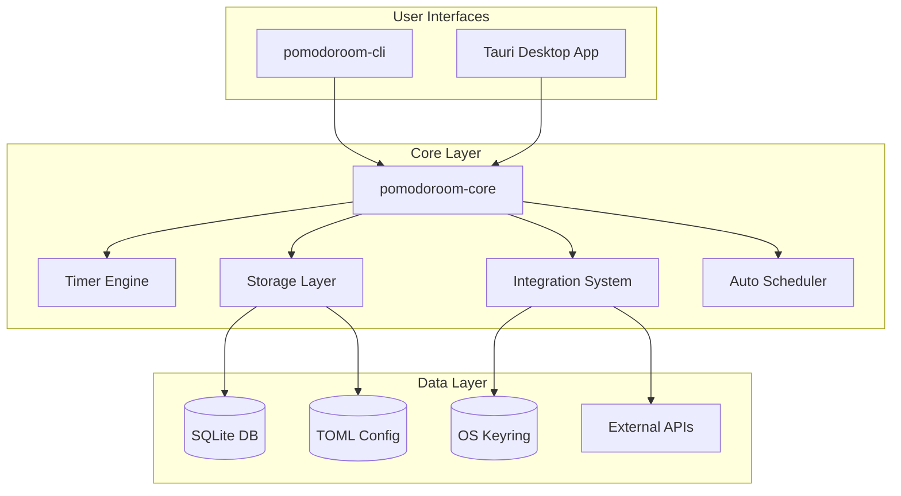
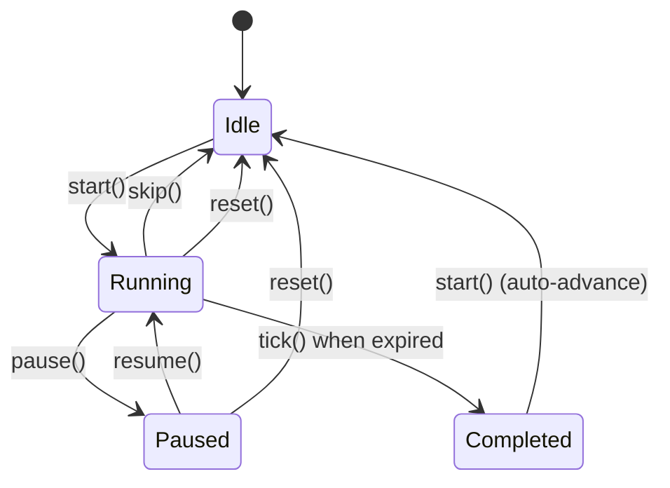
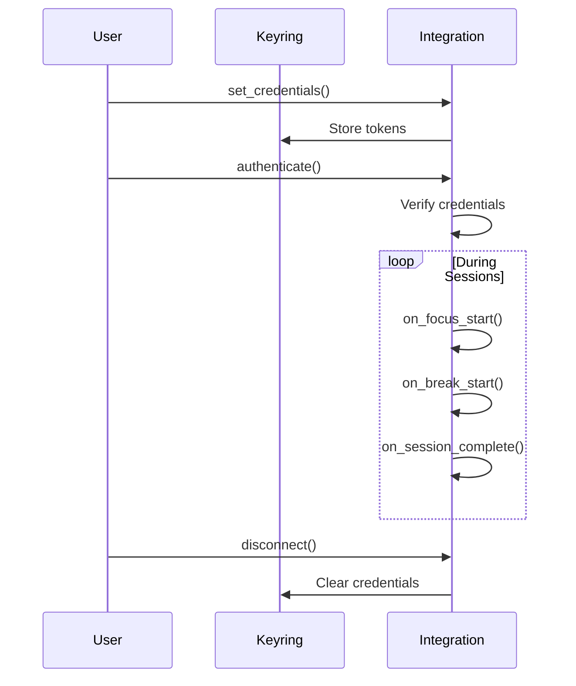
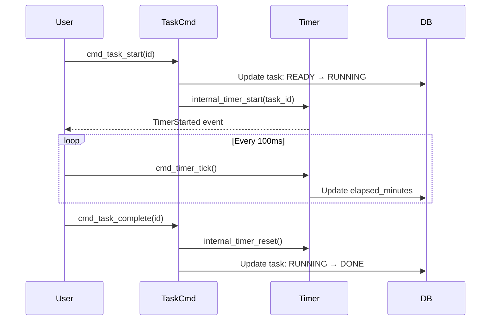
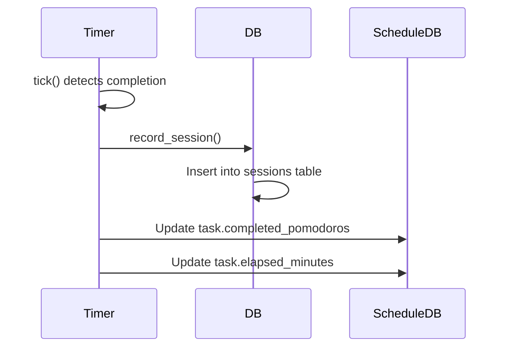

# Pomodoroom Architecture

High-level architecture overview of Pomodoroom - a CLI-first Pomodoro timer with Tauri desktop GUI.

## Overview

Pomodoroom follows a **CLI-first philosophy**: all business logic lives in the Rust core library (`pomodoroom-core`), exposed via both a standalone CLI binary (`pomodoroom-cli`) and a Tauri desktop application (`pomodoroom-desktop`). The GUI is a thin React skin over the same core library.



## Core Components

### Timer Engine

**Location**: `crates/pomodoroom-core/src/timer/engine.rs`

A wall-clock-based state machine that requires the caller to periodically invoke `tick()` for progress updates. It does not use internal threads.

**State Transitions**:


**Key Methods**:
- `start()` - Begin timer from Idle/Paused/Completed state
- `pause()` - Pause running timer
- `resume()` - Resume paused timer
- `skip()` - Skip to next step in schedule
- `reset()` - Reset to initial state
- `tick()` - Called periodically to update timer
- `snapshot()` - Get current state as Event

### Storage Layer

**Location**: `crates/pomodoroom-core/src/storage/`

Three storage mechanisms:

1. **SQLite Database** (`database.rs`): Session storage and statistics
   - `~/.config/pomodoroom/pomodoroom.db` (Linux)
   - `~/Library/Application Support/pomodoroom/pomodoroom.db` (macOS)
   - `%APPDATA%\pomodoroom\pomodoroom.db` (Windows)

2. **TOML Configuration** (`config.rs`): Application settings
   - `~/.config/pomodoroom/config.toml` (Linux)
   - `~/Library/Application Support/pomodoroom/config.toml` (macOS)
   - `%APPDATA%\pomodoroom\config.toml` (Windows)

3. **OS Keyring**: Secure OAuth token storage
   - Service: `pomodoroom`
   - Entry format: `pomodoroom-{service_name}`

### Integration System

**Location**: `crates/pomodoroom-core/src/integrations/`

Plugin system for external services. Each integration implements the `Integration` trait.

**Supported Integrations** (in priority order):
1. Google Calendar
2. Notion
3. Linear
4. GitHub
5. Discord
6. Slack

**Integration Lifecycle**:


### Auto Scheduler

**Location**: `crates/pomodoroom-core/src/scheduler/`

Generates daily schedules from:
- Daily template (wake/sleep times, fixed events)
- Available tasks
- Calendar events to avoid

**Output**: `ScheduledBlock` objects with:
- Start/end time
- Task association
- Lane assignment (for parallel execution)
- Lock status (user-pinned vs auto-scheduled)

## Tauri Bridge

**Location**: `src-tauri/src/bridge.rs`, `src-tauri/src/schedule_commands.rs`

Exposes core functionality to the React frontend via Tauri IPC commands.

### Timer Commands

| Command | Purpose |
|---------|---------|
| `cmd_timer_status` | Get current timer state |
| `cmd_timer_tick` | Advance timer and check completion |
| `cmd_timer_start` | Start timer with optional task/project |
| `cmd_timer_pause` | Pause running timer |
| `cmd_timer_resume` | Resume paused timer |
| `cmd_timer_skip` | Skip to next step |
| `cmd_timer_reset` | Reset to initial state |

### Task Commands

| Command | Purpose |
|---------|---------|
| `cmd_task_create` | Create new task |
| `cmd_task_update` | Update existing task |
| `cmd_task_delete` | Delete task |
| `cmd_task_list` | List tasks with filters |
| `cmd_task_get` | Get single task by ID |
| `cmd_task_start` | READY → RUNNING |
| `cmd_task_pause` | RUNNING → PAUSED |
| `cmd_task_resume` | PAUSED → RUNNING |
| `cmd_task_complete` | RUNNING → DONE |
| `cmd_task_postpone` | RUNNING/PAUSED → READY (priority -20) |
| `cmd_task_extend` | Add estimated minutes |
| `cmd_task_available_actions` | Get valid actions for task state |

### Schedule Commands

| Command | Purpose |
|---------|---------|
| `cmd_schedule_generate` | Generate schedule from template |
| `cmd_schedule_auto_fill` | Auto-fill available time slots |
| `cmd_schedule_create_block` | Create manual schedule block |
| `cmd_schedule_update_block` | Update schedule block |
| `cmd_schedule_delete_block` | Delete schedule block |
| `cmd_schedule_list_blocks` | List blocks for date range |

### OAuth Commands

| Command | Purpose |
|---------|---------|
| `cmd_store_oauth_tokens` | Store tokens in OS keyring |
| `cmd_load_oauth_tokens` | Load tokens from OS keyring |
| `cmd_clear_oauth_tokens` | Clear tokens from OS keyring |

## Frontend Architecture

**Location**: `src/`

Multi-window architecture with PureRef-style window management.

### Window Routing

Window label determines which view renders:
```typescript
const label = getCurrentWindow().label;
switch(label) {
  case 'main': return <ShellView />;
  case 'mini-timer': return <MiniTimerView />;
  case 'stats': return <StatsView />;
  case 'settings': return <SettingsView />;
  // ... etc
}
```

### Window Modes

| Mode | Decorations | Always-on-top | Size |
|------|-------------|---------------|------|
| Normal | Yes | No | 800x600 |
| Pinned | Yes | Yes | 800x600 |
| Float (Timer) | No | Yes | 280x280 |

### UI Migration (M3)

**Current Phase**: Material 3 redesign

```
src/components/        ← Old components (to be removed)
src/components/m3/     ← New M3 components
```

See `docs/ui-redesign-strategy.md` for full migration plan.

## Data Flow

### Timer ↔ Task Integration



### Focus Session Recording



## Error Handling

Core errors are defined in `crates/pomodoroom-core/src/error.rs`:

- `CoreError` - General core errors
- `DatabaseError` - SQLite operation errors
- `ConfigError` - Configuration file errors
- `OAuthError` - OAuth authentication errors
- `ValidationError` - Input validation errors
- `TaskTransitionError` - Invalid state transitions

All errors implement `std::error::Error` and can be converted to strings for IPC transport.

## Security Considerations

### Input Validation

All Tauri commands validate inputs:
- Task/Project IDs: non-empty, max 100 chars, no null bytes
- Dates: within ±100 years from now
- Names: non-empty, max 500 chars, no control characters
- Priority: clamped to 0-100 range

### OAuth Token Storage

OAuth tokens are stored securely using the OS keyring via the `keyring` crate:
- Service name: `pomodoroom`
- Entry name: `pomodoroom-{service_name}` (e.g., `pomodoroom-google`)

Tokens are never stored in plaintext files or environment variables.

## File Structure

```
pomodoroom/
├── Cargo.toml                 # Workspace definition
├── crates/
│   ├── pomodoroom-core/       # Core library
│   │   ├── src/
│   │   │   ├── timer/         # Timer engine
│   │   │   ├── storage/       # DB, config, keyring
│   │   │   ├── integrations/  # External service plugins
│   │   │   ├── timeline/      # Time gap detection
│   │   │   ├── scheduler/     # Auto-scheduling
│   │   │   └── task/          # Task state machine
│   │   └── Cargo.toml
│   └── pomodoroom-cli/        # CLI binary
│       └── src/
│           └── commands/      # Command handlers
├── src-tauri/                 # Desktop app
│   ├── src/
│   │   ├── bridge.rs          # IPC commands (timer, config, stats)
│   │   ├── schedule_commands.rs  # Task/project/schedule commands
│   │   ├── integration_commands.rs  # Integration commands
│   │   ├── window.rs          # Window management
│   │   └── tray.rs            # System tray
│   └── Cargo.toml
├── src/                       # React frontend
│   ├── main.tsx
│   ├── App.tsx
│   ├── components/
│   │   ├── m3/                # Material 3 components
│   │   └── ...
│   ├── views/                 # Window-specific views
│   ├── hooks/                 # React hooks
│   └── types/                 # TypeScript definitions
└── docs/                      # Documentation
```

## Extension Points

### Adding a New Integration

1. Create `crates/pomodoroom-core/src/integrations/{service}.rs`
2. Implement the `Integration` trait
3. Add authentication flow in `authenticate()`
4. Add service to integration registry
5. Add CLI commands in `crates/pomodoroom-cli/src/commands/auth.rs`
6. Add Tauri commands in `src-tauri/src/integration_commands.rs`

### Adding a New CLI Command

1. Create handler in `crates/pomodoroom-cli/src/commands/{category}.rs`
2. Add variant to `Commands` enum in `main.rs`
3. Add match arm in `main()` function
4. Call appropriate core library functions

### Adding a New IPC Command

1. Add `#[tauri::command]` function in `bridge.rs` or `schedule_commands.rs`
2. Register command in `src-tauri/src/main.rs`
3. Add TypeScript wrapper in frontend if needed
