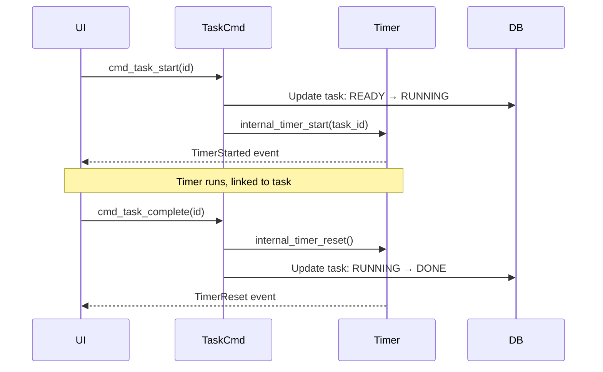

# Pomodoroom Migration Guide

Guide for migrating between versions and platforms.

## Table of Contents

- [v1 → v2 Migration](#v1--v2-migration)
- [localStorage → SQLite Migration](#localstorage--sqlite-migration)
- [Key Integration Points](#key-integration-points)
- [Rollback Instructions](#rollback-instructions)

---

## v1 → v2 Migration

Pomodoroom v2 introduces significant architectural changes:

### Major Changes

1. **Backend Migration**: All business logic moved to Rust core library
2. **Storage Migration**: localStorage → SQLite for persistent data
3. **OAuth Security**: In-memory tokens → OS keyring
4. **Task State Machine**: Proper state transitions with validation

### Data Migration

#### Sessions and Statistics

**v1 (localStorage)**:
```typescript
localStorage.getItem("pomodoroom_sessions")
```

**v2 (SQLite)**:
```rust
use pomodoroom_core::Database;
let db = Database::open()?;
let stats = db.stats_today()?;
```

#### Task Storage

**v1 (localStorage)**:
```typescript
const tasks = JSON.parse(localStorage.getItem("tasks") || "[]");
```

**v2 (ScheduleDb)**:
```rust
use pomodoroom_core::storage::ScheduleDb;
let db = ScheduleDb::open()?;
let tasks = db.list_tasks()?;
```

#### Configuration

**v1 (localStorage)**:
```typescript
localStorage.getItem("config")
```

**v2 (TOML)**:
```rust
use pomodoroom_core::Config;
let config = Config::load_or_default();
```

### API Migration

#### Timer Commands

| v1 (localStorage) | v2 (Tauri IPC) |
|-------------------|----------------|
| `timer.start()` | `invoke("cmd_timer_start")` |
| `timer.pause()` | `invoke("cmd_timer_pause")` |
| `timer.reset()` | `invoke("cmd_timer_reset")` |

**Before (v1)**:
```typescript
import { timer } from "./stores/timer";
timer.start();
```

**After (v2)**:
```typescript
import { invoke } from "@tauri-apps/api/core";
await invoke("cmd_timer_start");
```

#### Task Commands

| v1 (localStorage) | v2 (Tauri IPC) |
|-------------------|----------------|
| `tasks.create()` | `invoke("cmd_task_create", ...)` |
| `tasks.update()` | `invoke("cmd_task_update", ...)` |
| `tasks.delete()` | `invoke("cmd_task_delete", ...)` |

**Before (v1)**:
```typescript
import { tasks } from "./stores/tasks";
tasks.create({ title: "My Task" });
```

**After (v2)**:
```typescript
import { invoke } from "@tauri-apps/api/core";
await invoke("cmd_task_create", {
  title: "My Task"
});
```

### Frontend Hooks Migration

#### useTaskStore

**Before (v1)**:
```typescript
import { useTaskStore } from "./stores/useTaskStore";
const { tasks, createTask, updateTask } = useTaskStore();
```

**After (v2)**:
```typescript
import { invoke } from "@tauri-apps/api/core";
import { useQuery, useMutation } from "@tanstack/react-query";

const { data: tasks } = useQuery({
  queryKey: ["tasks"],
  queryFn: () => invoke("cmd_task_list")
});

const createTask = useMutation({
  mutationFn: (task) => invoke("cmd_task_create", { task })
});
```

#### useTimer

**Before (v1)**:
```typescript
import { useTimer } from "./stores/useTimer";
const { state, start, pause } = useTimer();
```

**After (v2)**:
```typescript
import { invoke } from "@tauri-apps/api/core";
import { useTimerQuery } from "./hooks/useTimerQuery";

const { state, start, pause } = useTimerQuery();
```

---

## localStorage → SQLite Migration

### Data Migration Script

The following script helps migrate existing data from localStorage to SQLite:

```typescript
// migration-script.ts
import { invoke } from "@tauri-apps/api/core";

interface LegacyTask {
  id: string;
  title: string;
  description?: string;
  completed: boolean;
  // ... other fields
}

interface LegacySession {
  id: string;
  startTime: string;
  endTime: string;
  duration: number;
  // ... other fields
}

async function migrateTasks() {
  // Read from localStorage
  const legacyTasks: LegacyTask[] = JSON.parse(
    localStorage.getItem("tasks") || "[]"
  );

  // Migrate to SQLite
  for (const task of legacyTasks) {
    try {
      await invoke("cmd_task_create", {
        title: task.title,
        description: task.description,
        completed: task.completed,
        // Map other fields...
      });
    } catch (e) {
      console.error(`Failed to migrate task ${task.id}:`, e);
    }
  }
}

async function migrateSessions() {
  // Sessions are handled internally by the core library
  // They are automatically recorded when timer completes
  // No manual migration needed
}

async function migrateConfig() {
  // Read config from localStorage
  const legacyConfig = JSON.parse(
    localStorage.getItem("config") || "{}"
  );

  // Migrate to TOML config
  for (const [key, value] of Object.entries(legacyConfig)) {
    try {
      await invoke("cmd_config_set", {
        key,
        value: String(value)
      });
    } catch (e) {
      console.error(`Failed to migrate config ${key}:`, e);
    }
  }
}

export async function runMigration() {
  console.log("Starting migration...");

  await migrateTasks();
  await migrateConfig();

  // Backup old data
  const backup = {
    tasks: localStorage.getItem("tasks"),
    config: localStorage.getItem("config"),
    sessions: localStorage.getItem("sessions")
  };
  localStorage.setItem("legacy_backup", JSON.stringify(backup));

  console.log("Migration complete!");
}
```

### Verification

After migration, verify data integrity:

```typescript
// Verify task count
const localCount = JSON.parse(localStorage.getItem("tasks") || "[]").length;
const dbTasks = await invoke("cmd_task_list");
console.log(`Tasks: ${localCount} → ${dbTasks.length}`);

// Verify config
const localConfig = JSON.parse(localStorage.getItem("config") || "{}");
const dbConfig = await invoke("cmd_config_list");
console.log(`Config keys: ${Object.keys(localConfig).length} → ${Object.keys(dbConfig).length}`);
```

---

## Key Integration Points

### Timer ↔ Task Integration

The timer and task systems are now integrated:



### Session Recording

Sessions are automatically recorded when timer completes:

```rust
// In bridge.rs, cmd_timer_tick
if let Some(Event::TimerCompleted { .. }) = completed {
    db_guard.record_session(
        step_type,
        &step_label,
        duration_min,
        started_at,
        completed_at,
        task_id,
        project_id,
    )?;

    // Update task counters
    schedule_db.update_task(&task)?;
}
```

### OAuth Token Storage

OAuth tokens are now stored in OS keyring:

```typescript
// Store tokens
await invoke("cmd_store_oauth_tokens", {
  service_name: "google",
  tokens_json: JSON.stringify(tokens)
});

// Load tokens
const tokensJson = await invoke("cmd_load_oauth_tokens", {
  service_name: "google"
});
const tokens = JSON.parse(tokensJson || "null");

// Clear tokens
await invoke("cmd_clear_oauth_tokens", {
  service_name: "google"
});
```

---

## Rollback Instructions

If you need to rollback from v2 to v1:

### 1. Backup v2 Data

```bash
# Copy SQLite database
cp ~/.config/pomodoroom/pomodoroom.db ~/backup/pomodoroom-v2.db

# Copy TOML config
cp ~/.config/pomodoroom/config.toml ~/backup/config-v2.toml
```

### 2. Restore v1 Data

```typescript
// Restore from backup
const backup = JSON.parse(localStorage.getItem("legacy_backup") || "{}");

localStorage.setItem("tasks", backup.tasks || "[]");
localStorage.setItem("config", backup.config || "{}");
localStorage.setItem("sessions", backup.sessions || "[]");
```

### 3. Install v1

```bash
git checkout v1.0.0
pnpm install
pnpm run dev
```

### 4. Clear v2 Data (Optional)

```bash
# Remove SQLite database
rm ~/.config/pomodoroom/pomodoroom.db

# Remove TOML config
rm ~/.config/pomodoroom/config.toml

# Clear OAuth tokens
# This varies by platform - use keyring tools
```

---

## Troubleshooting Migration

### Issue: Tasks Not Appearing

**Cause**: Migration didn't run properly

**Solution**: Run migration script manually
```typescript
import { runMigration } from "./migration-script";
await runMigration();
```

### Issue: Sessions Missing

**Cause**: Sessions are recorded automatically in v2, not migrated

**Solution**: v1 sessions are preserved in localStorage backup. They're kept for reference but not migrated to SQLite.

### Issue: Configuration Lost

**Cause**: Config keys may have different names

**Solution**: Check `docs/API.md` for current config keys
```typescript
// Old key
localStorage.getItem("focusDuration")

// New key
await invoke("cmd_config_get", { key: "focus_duration" })
```

### Issue: OAuth Tokens Invalid

**Cause**: Tokens stored in-memory in v1 need to be re-authenticated

**Solution**: Re-authenticate with each service
```bash
# CLI
pomodoroom-cli auth login google
pomodoroom-cli auth login notion

# Or via UI settings
```

---

## Testing Migration

### Pre-Migration Checklist

- [ ] Backup current data
- [ ] Note current version
- [ ] Close all Pomodoroom windows
- [ ] Ensure no processes running

### Post-Migration Checklist

- [ ] Verify task count matches
- [ ] Verify configuration settings
- [ ] Test timer start/stop
- [ ] Test task operations (create, update, complete)
- [ ] Test statistics display
- [ ] Re-authenticate integrations if needed

### Migration Test Script

```typescript
// test-migration.ts
import { invoke } from "@tauri-apps/api/core";

async function testMigration() {
  const results = {
    tasks: { before: 0, after: 0 },
    config: { before: 0, after: 0 },
    timer: false,
  };

  // Test tasks
  const localTasks = JSON.parse(localStorage.getItem("tasks") || "[]");
  results.tasks.before = localTasks.length;
  const dbTasks = await invoke("cmd_task_list");
  results.tasks.after = dbTasks.length;

  // Test config
  const localConfig = JSON.parse(localStorage.getItem("config") || "{}");
  results.config.before = Object.keys(localConfig).length;
  const dbConfig = await invoke("cmd_config_list");
  results.config.after = Object.keys(dbConfig).length;

  // Test timer
  try {
    await invoke("cmd_timer_start");
    const status = await invoke("cmd_timer_status");
    results.timer = status.state === "running";
    await invoke("cmd_timer_reset");
  } catch (e) {
    results.timer = false;
  }

  console.log("Migration Test Results:", results);
  return results;
}

export { testMigration };
```

---

## Getting Help

If you encounter issues during migration:

1. Check this guide for common issues
2. Review `docs/ARCHITECTURE.md` for system understanding
3. Review `docs/API.md` for API changes
4. Open an issue on GitHub with:
   - Current and target versions
   - Steps taken
   - Error messages
   - Platform information
