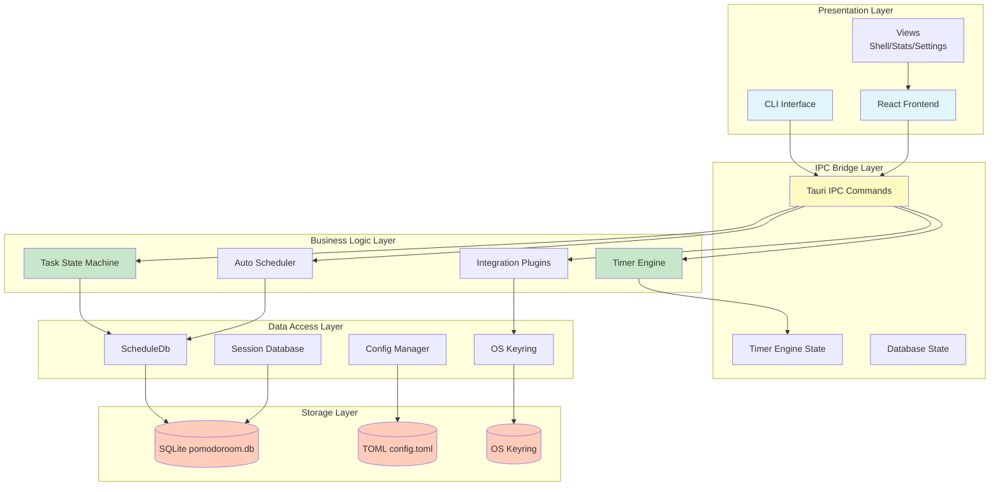
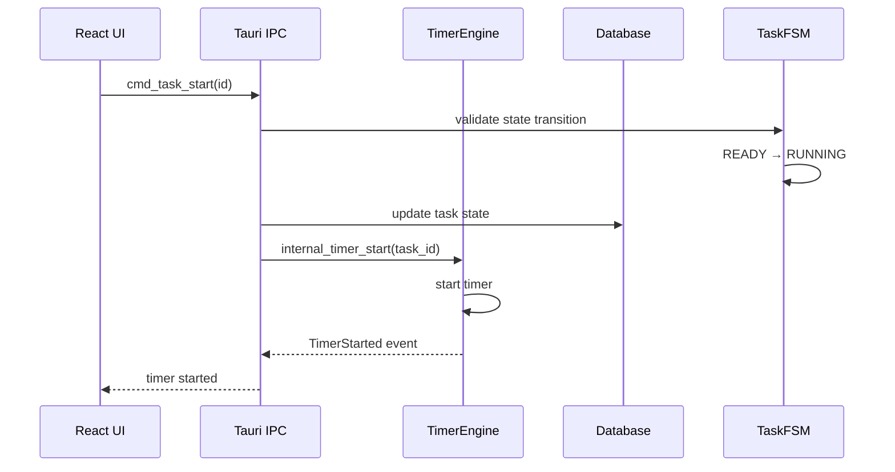
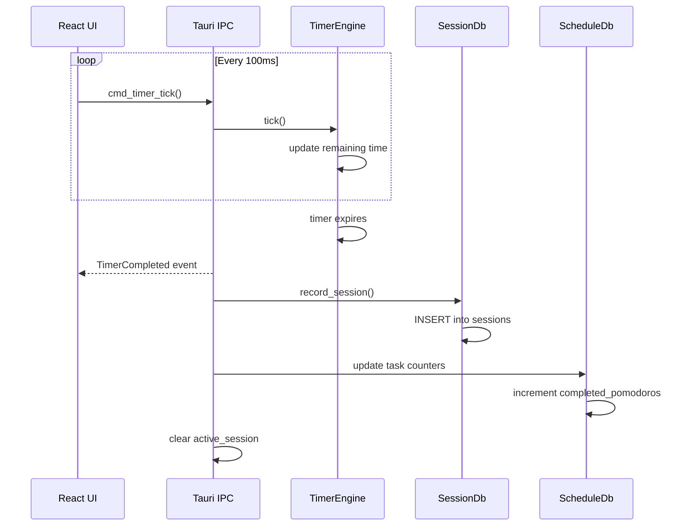
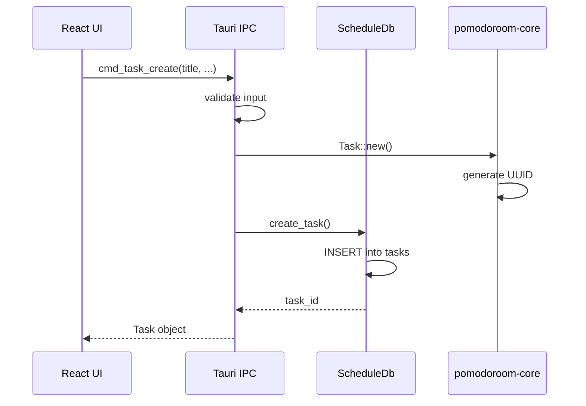
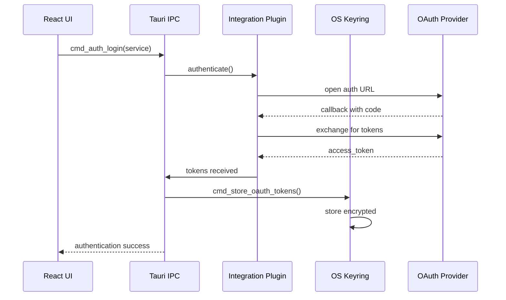
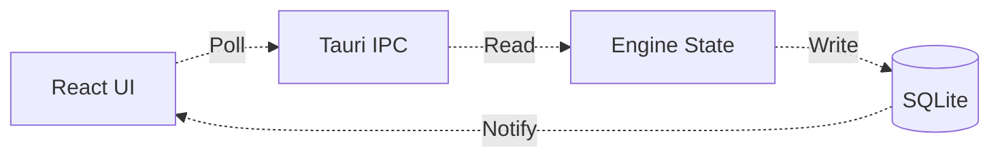
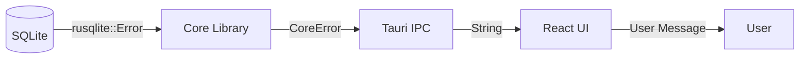

# Pomodoroom Architecture

Layer-by-layer architecture diagram with data flow and state management responsibilities.

## Layer Architecture



## Data Flow Diagrams

### Timer Start Flow



### Focus Session Recording



### Task Creation Flow



### OAuth Authentication Flow



## State Management Responsibilities

### Frontend (React)

| State | Management | Scope |
|-------|------------|-------|
| Current View | Router | Session |
| Window Mode | Tauri Window API | Per-window |
| UI Theme | localStorage | User preference |
| Form Input | React useState | Component |
| Timer Display | Polling IPC | Global |

**NOT responsible for**:
- Timer state (managed by Rust)
- Task data (queried from Rust)
- Session history (stored in SQLite)

### Backend (Rust Core)

| State | Management | Location |
|-------|------------|----------|
| Timer State | TimerEngine | In-memory |
| Task State | ScheduleDb | SQLite |
| Sessions | SessionDb | SQLite |
| Configuration | Config | TOML file |
| OAuth Tokens | OS Keyring | Encrypted storage |

### State Synchronization



**Synchronization Rules**:
1. UI polls timer state every 100ms via `cmd_timer_tick`
2. Timer events trigger state updates in Engine
3. Session completion writes to Database
4. Task operations validate state transitions before committing
5. Configuration changes write directly to TOML

## Component Relationships

### Timer ↔ Task Integration

The timer and task systems are linked through the `active_session` tracking:

```rust
struct ActiveSession {
    task_id: Option<String>,
    project_id: Option<String>,
    started_at: Option<DateTime<Utc>>,
    last_elapsed_update: Option<DateTime<Utc>>,
}
```

**When task starts**:
1. Task state: READY → RUNNING
2. Timer auto-starts with `task_id`
3. `active_session` populated

**When timer completes**:
1. Session recorded to database
2. Task's `completed_pomodoros` incremented
3. Task's `elapsed_minutes` incremented
4. `active_session` cleared

### Integration Plugin System

Each integration implements the `Integration` trait:

```rust
pub trait Integration {
    fn name(&self) -> &str;
    fn authenticate(&mut self) -> Result<()>;
    fn on_focus_start(&self, label: &str, duration: u64) -> Result<()>;
    fn on_break_start(&self, label: &str, duration: u64) -> Result<()>;
    fn on_session_complete(&self, session: &SessionRecord) -> Result<()>;
}
```

**Lifecycle**:
1. User authenticates → Tokens stored in OS keyring
2. Integration loaded from keyring credentials
3. Callbacks invoked during timer events
4. User disconnects → Tokens removed from keyring

## Storage Layer Details

### SQLite Database Location

| Platform | Path |
|----------|------|
| Linux | `~/.config/pomodoroom/pomodoroom.db` |
| macOS | `~/Library/Application Support/pomodoroom/pomodoroom.db` |
| Windows | `%APPDATA%\pomodoroom\pomodoroom.db` |

### TOML Configuration Location

| Platform | Path |
|----------|------|
| Linux | `~/.config/pomodoroom/config.toml` |
| macOS | `~/Library/Application Support/pomodoroom/config.toml` |
| Windows | `%APPDATA%\pomodoroom\config.toml` |

### OS Keyring Entry Format

```
Service: "pomodoroom"
Username: "{service_name}" (e.g., "google", "notion")
Password: "{JSON tokens}"
```

## Error Handling Strategy

### Layer Responsibility

| Layer | Error Handling |
|-------|----------------|
| React UI | Display user-friendly messages |
| Tauri IPC | Convert Rust errors to Strings |
| Core Library | Return Result<T, E> |
| Storage | Return rusqlite::Error |

### Error Flow



### Error Types

```rust
pub enum CoreError {
    Database(DatabaseError),
    Config(ConfigError),
    OAuth(OAuthError),
    Validation(ValidationError),
    TaskTransition(TaskTransitionError),
}
```

## Security Boundaries

### Input Validation

All Tauri commands validate inputs before processing:
- Task/Project IDs: non-empty, max 100 chars, no control characters
- Dates: within ±100 years from now
- Names: non-empty, max 500 chars
- Priority: clamped to 0-100 range

### OAuth Token Security

- **Never** stored in plaintext files
- **Never** passed through environment variables
- **Always** encrypted in OS keyring
- Service name: `pomodoroom`
- Entry format: `pomodoroom-{service_name}`

### Database Access

- Single connection per process
- Mutex-protected for concurrent access
- WAL mode for better concurrency
- Foreign key constraints for referential integrity

## Extension Points

### Adding a New Integration

1. Create `crates/pomodoroom-core/src/integrations/{service}.rs`
2. Implement `Integration` trait
3. Add to integration registry
4. Add CLI commands in `pomodoroom-cli`
5. Add Tauri commands in `src-tauri/src/integration_commands.rs`
6. Update documentation

### Adding a New Tauri Command

1. Add `#[tauri::command]` function in `bridge.rs` or `schedule_commands.rs`
2. Register in `src-tauri/src/main.rs`
3. Add TypeScript wrapper if needed
4. Update `docs/API.md`
5. Add tests

### Adding a New CLI Command

1. Create handler in `crates/pomodoroom-cli/src/commands/{category}.rs`
2. Add variant to `Commands` enum in `main.rs`
3. Add match arm in `main()` function
4. Update shell completions
5. Update `docs/CLI_REFERENCE.md`
